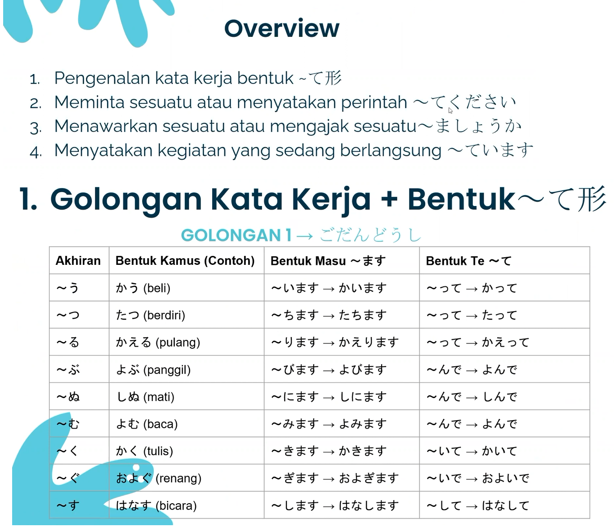
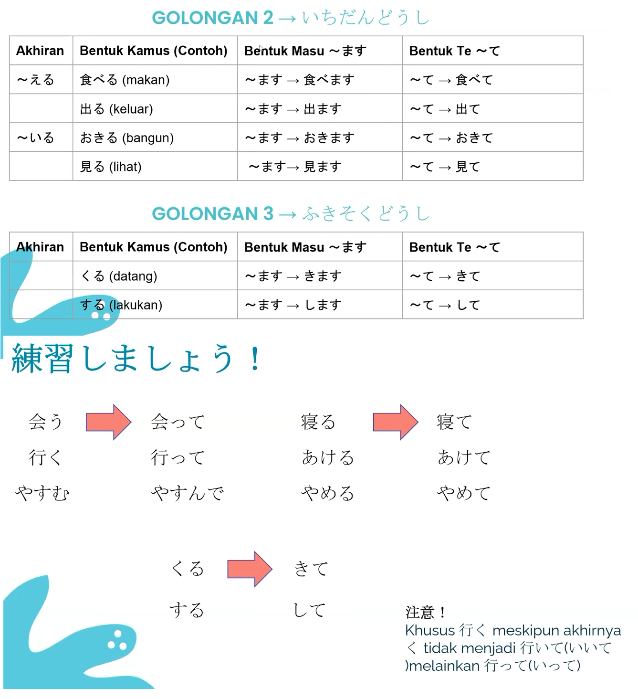
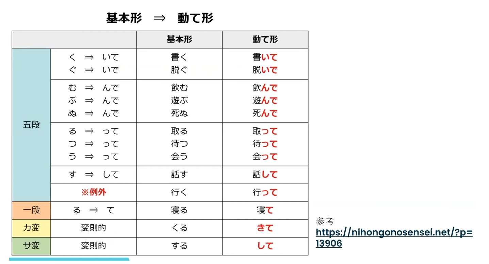

## ～る Kata Kerja

～る **tidak selalu Golongan 2**.

- Sebelum る = **い / え** → biasanya **Golongan 2**
- Ada pengecualian → **Golongan 1**

寝る → Golongan 2 ✅  
食べる → Golongan 2 ✅  
帰る → Golongan 1 ❗  
入る → Golongan 1 ❗  
走る → Golongan 1 ❗

**Jadi ～る saja tidak cukup untuk menentukan golongan.**

---

### ます形 dan て形

**ます = bentuk sopan**

**て = bentuk penghubung/pembentuk pola, bukan penentu sopan**

Kalau **勉強する（べんきょうする）**:

- **Kamus:** 勉強する → *benkyou suru* → belajar
- **ます形:** 勉強します → *benkyou shimasu* → belajar (sopan)
- **て形:** 勉強して → *benkyou shite* → bentuk て

Jadi:

> 勉強する → 勉強します → 勉強して  
> *benkyou suru* → *benkyou shimasu* → *benkyou shite*  
> kamus → ます形 → て形

---

## は dan が

### 1. は = Penanda TOPIK

Menunjukkan **“kalau soal X...”** atau apa yang sedang dibicarakan.

**私は学生です。**  
**わたしは がくせいです。**  
*Watashi wa gakusei desu.*  
→ Saya adalah pelajar.

**私** = topik pembicaraan → **は**

---

### 2. が = Penanda SUBJEK

Menunjukkan **siapa/apa yang melakukan atau mengalami sesuatu**.

**雨が降っています。**  
**あめが ふっています。**  
*Ame ga futte imasu.*  
→ Hujan sedang turun.

**雨** = subjek dari **降っています** → **が**

Strukturnya:

> 雨が降っています  
> *Ame ga futte imasu*  
> → hujan yang turun / hujan sedang turun

---

### Bedanya paling gampang

> **は → “kalau soal X...”**
>
> **が → “X-lah yang...”**

Contoh:

**私は日本語が好きです。**  
**わたしは にほんごが すきです。**  
*Watashi wa nihongo ga suki desu.*  
→ Kalau saya, saya suka bahasa Jepang.

- **私は** = kalau soal saya → **topik**
- **日本語が** = bahasa Jepang-lah yang disukai → **subjek**

Jadi **topik dan subjek tidak selalu sama**.

> **は = TOPIK**
>
> **が = SUBJEK**

**が bukan khusus untuk kata sifat.**  
が bisa muncul dengan **kata kerja, kata sifat, maupun pola lainnya**.