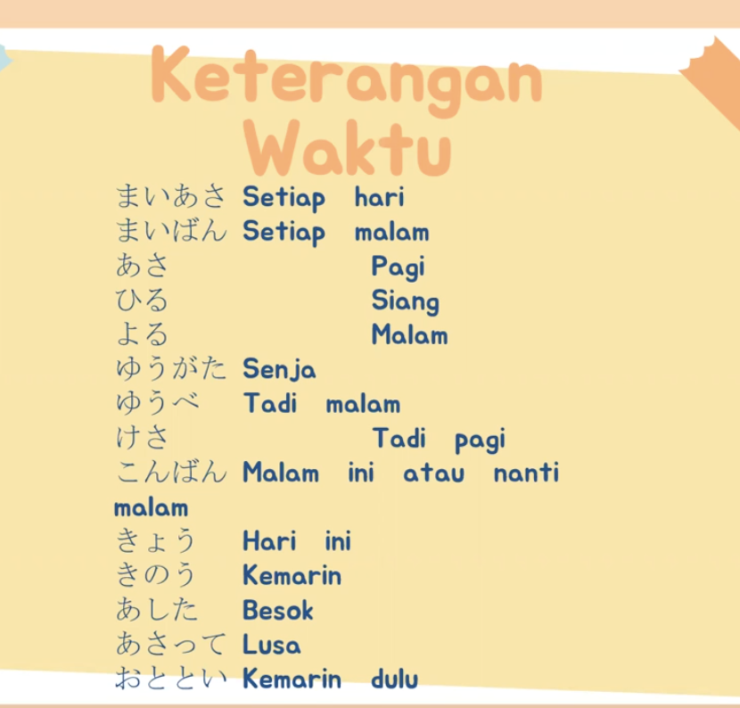

# Pola Kalimat Dasar — ～ます・～ました・～ません・～ませんでした

## Pola Tanya dan Jawaban

### ① ～ますか？

**Q: たべますか？**

> Tabemasu ka?
>
> → Apakah makan?

**A: はい、たべます。**

> Hai, tabemasu.
>
> → Ya, makan.

---

### ② ～ましたか？

**Q: たべましたか？**

> Tabemashita ka?
>
> → Apakah sudah makan?

**A: はい、たべました。**

> Hai, tabemashita.
>
> → Ya, sudah makan.

---

## Polanya gampang

| Pertanyaan | Jawaban |
|---|---|
| ～ますか？ | ～ます。 |
| ～ましたか？ | ～ました。 |
| ～ませんか？ | ～ません。 |
| ～ませんでしたか？ | ～ませんでした。 |

### Arti bentuk

- **～ます** = melakukan / akan melakukan
- **～ました** = sudah melakukan
- **～ません** = tidak melakukan / tidak akan melakukan
- **～ませんでした** = tidak melakukan / tidak sudah melakukan

---

# Kosakata dan Ekspresi

### 身体・人の特徴

| Bahasa Jepang | Romaji | Arti |
|---|---|---|
| せがたかい | se ga takai | tinggi badan tinggi |
| せがひくい | se ga hikui | tinggi badan pendek |
| あたまがいい | atama ga ii | pintar |
| かおがきれい | kao ga kirei | wajahnya cantik |

---

# は dan が

## Contoh Kalimat

**田中さんは やさしくて、せが たかい ひとです。**

> Tanaka-san wa yasashikute, se ga takai hito desu.

→ Tanaka-san adalah orang yang baik dan tinggi.

Dalam kalimat tersebut terdapat **は (wa)** dan **が (ga)**, tetapi keduanya mempunyai fungsi yang berbeda.

---

## ① は → menandai topik utama

**田中さんは**

> Tanaka-san wa

→ "Kalau Tanaka-san..." / "Tanaka-san itu..."

Jadi, **Tanaka-san** adalah topik utama seluruh kalimat.

---

## ② が → menandai subjek dari 高い

**背が高い**

> se ga takai

→ tinggi badannya tinggi → tinggi

Strukturnya:

- **背（せ / se）** = tinggi badan
- **が（ga）** = penanda subjek
- **高い（たかい / takai）** = tinggi

Jadi, **が** digunakan karena yang menjadi subjek dari **高い** adalah **背**.

---

## Struktur Lengkap

**田中さんは | やさしくて | 背が高い | 人です**

> Tanaka-san wa | yasashikute | se ga takai | hito desu

Artinya:

> Tanaka-san | baik dan | tinggi badannya | adalah orang

→ **Tanaka-san adalah orang yang baik dan tinggi.**

---

# Contoh ～くて dengan Kata Sifat い

**このラーメンは 安くて、おいしいです。**

> Kono raamen wa yasukute, oishii desu.

→ Ramen ini murah dan enak.

### Struktur

**このラーメンは**

→ topik: "ramen ini"

**安くて**

→ murah + bentuk ～て

**おいしいです**

→ enak

---

## Kenapa tidak menggunakan が?

Karena **安い（やすい）** dan **おいしい** sama-sama langsung menerangkan topik **このラーメン**.

**このラーメンは 安くて、おいしいです。**

> Kono raamen wa yasukute, oishii desu.

→ Ramen ini murah dan enak.

Tidak perlu mengatakan:

> ❌ このラーメンは 安くて、ラーメンがおいしいです。

Karena subjeknya sudah jelas, yaitu **このラーメン**.

---

# Perbandingan は dan が

## Contoh ①

**このラーメンは 安くて、おいしいです。**

> Kono raamen wa yasukute, oishii desu.

- **このラーメンは** → topik
- **安くて** → murah + bentuk ～て
- **おいしいです** → enak

→ Ramen ini murah dan enak.

---

## Contoh ②

**田中さんは 背が高い人です。**

> Tanaka-san wa se ga takai hito desu.

- **田中さんは** → Tanaka sebagai topik
- **背が** → tinggi badan sebagai subjek
- **高い** → tinggi
- **人です** → adalah orang

→ Tanaka-san adalah orang yang tinggi.

---

# Ringkasan

### は（wa）

**は = penanda topik**

Contoh:

> 田中さんは

→ Tanaka-san adalah topik pembicaraan.

---

### が（ga）

**が = penanda subjek**

Contoh:

> 背が高い

→ **背（se）** adalah subjek dari **高い（takai）**.

---

## Ingat!

**田中さんは やさしくて、背が高い人です。**

> Tanaka-san wa yasashikute, se ga takai hito desu.

Di sini:

> **田中さんは** → topik utama

> **背が** → subjek dari 高い

> **高い** → tinggi

Jadi **は** dan **が** bukan memiliki fungsi yang sama.

**は → topik**

**が → subjek**