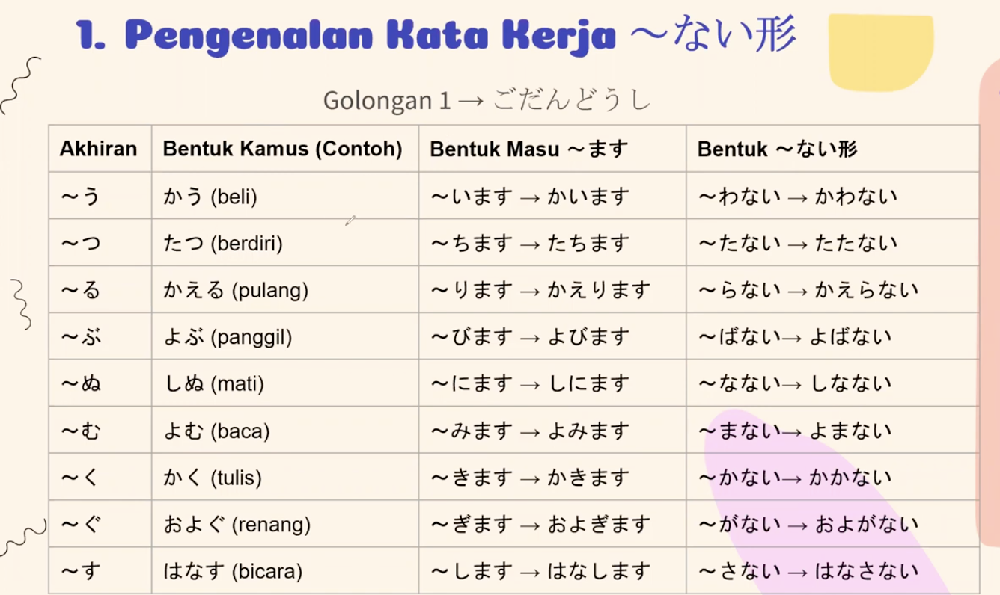
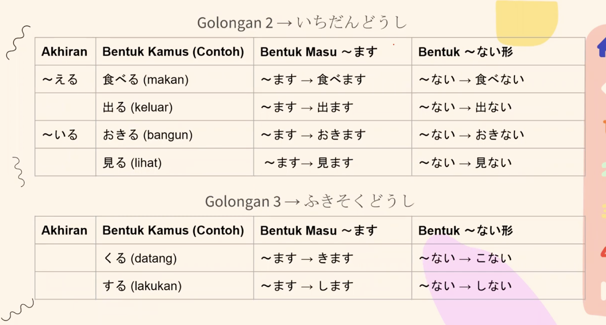
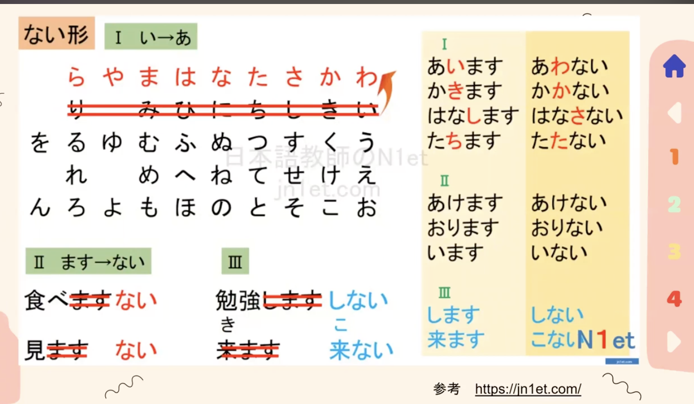
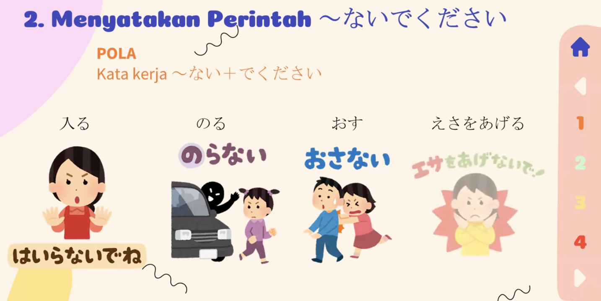
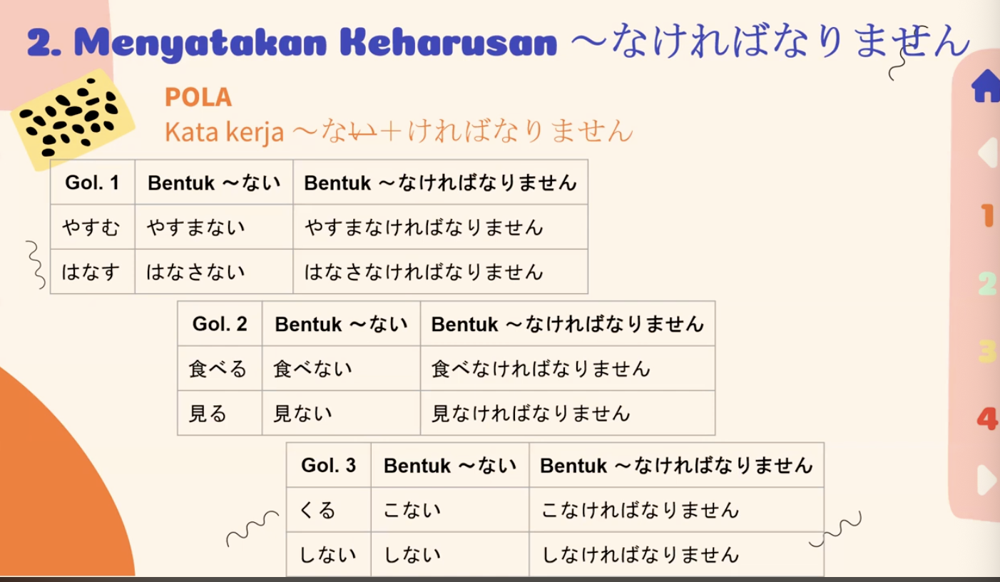
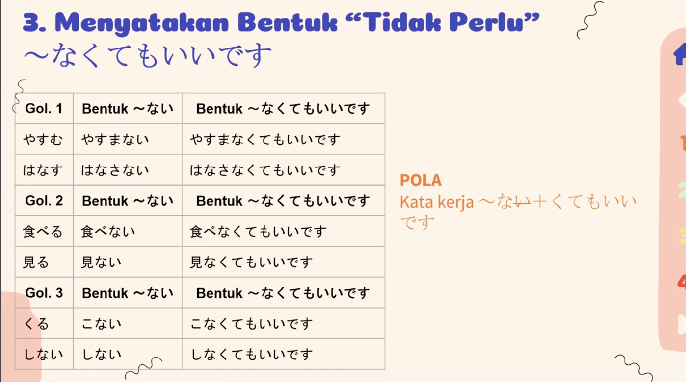

Jenis	Positif	Negatif
Kata kerja	食べます	食べない
い-adjective	高い	高くない
な-adjective	きれいです	きれいじゃありません

Tapi hati-hati: ini mencampur gaya biasa (ない) dan gaya sopan (じゃありません). Kalau kamu sedang belajar bentuk ～ない, biasanya kata kerja dan kata sifat juga punya aturan khusus untuk bentuk negatifnya.

む → まない → 読む → 読まない
く → かない → 書く → 書かない
す → さない → 話す → 話さない
つ → たない → 待つ → 待たない
ぶ → ばない → 呼ぶ → 呼ばない
ぬ → なない → 死ぬ → 死なない
る → らない → 帰る → 帰らない
う → わない → 買う → 買わない ⚠️

Jadi kamu bisa membayangkan:

Golongan 1 + ない = pindahkan ujungnya ke baris あ + ない

mu jadi ma　む　ーー＞　ま

ない　ーー＞　なければないません　

ない　ーー＞　なくてもいいです
