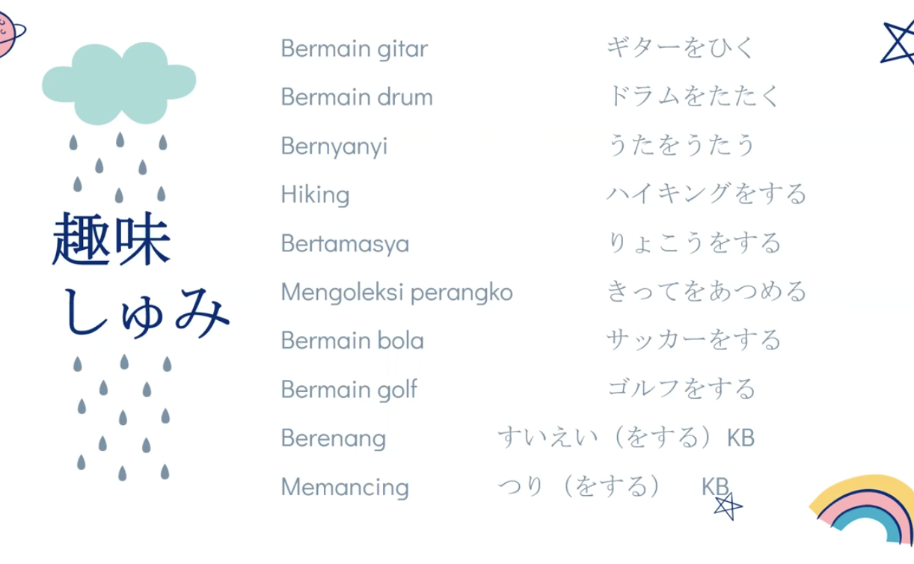

～こと — Note singkat

V bentuk kamus + こと = menjadikan kata kerja sebagai kata benda (kegiatan/hal melakukan V).

Mirip konsep gerund (-ing) dalam bahasa Inggris.

私の趣味は ～ことです。
= Hobi saya adalah ～.

