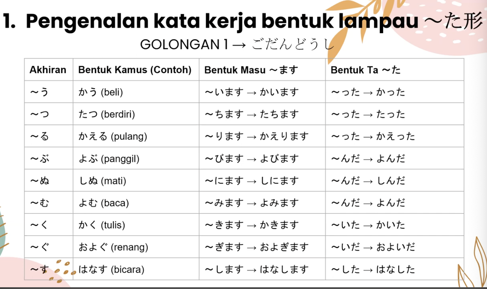
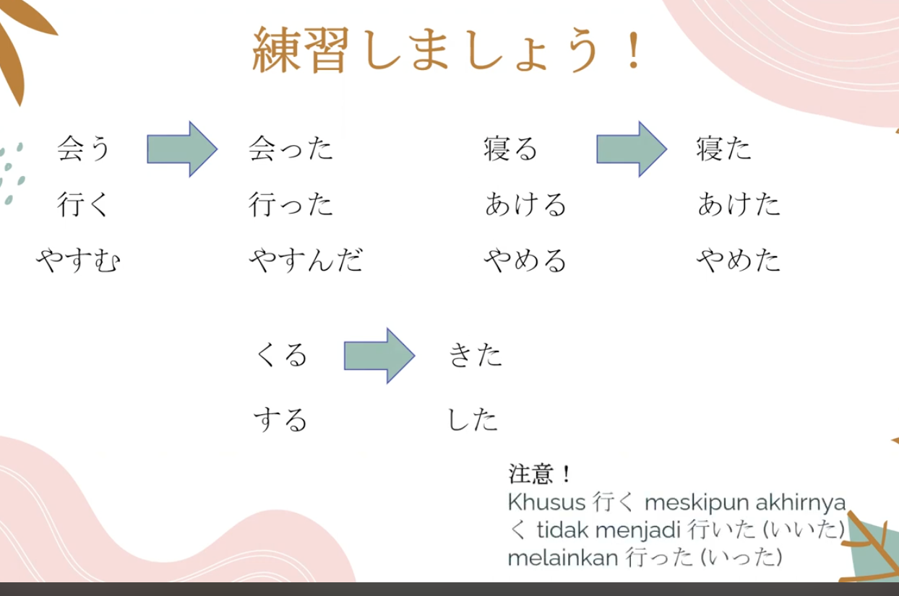
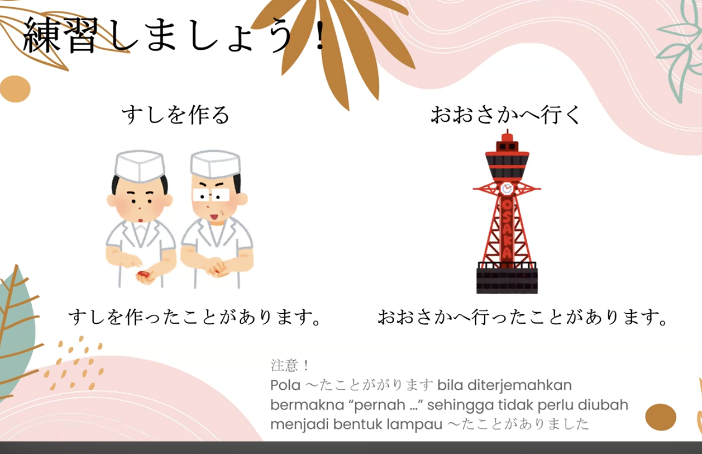
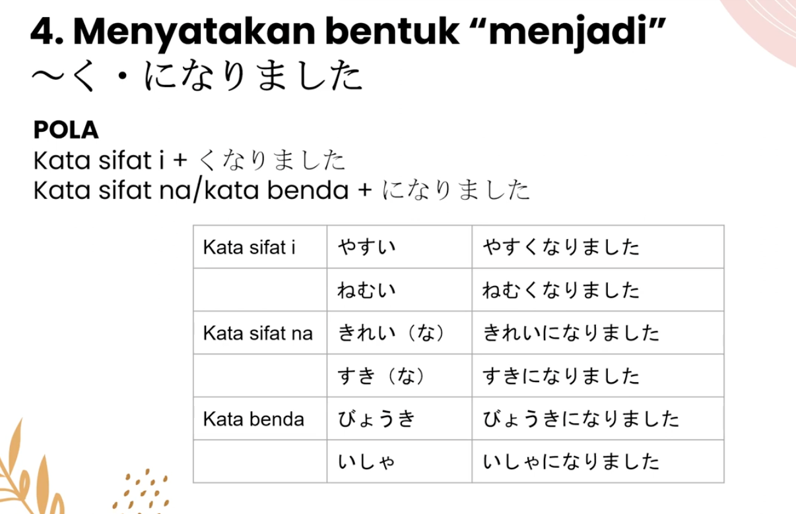

V bentuk た + ことがあります
= pernah melakukan V

Contoh:

日本へ行ったことがあります。
Nihon e itta koto ga arimasu.
= Saya pernah pergi ke Jepang.

寿司を食べたことがあります。
Sushi o tabeta koto ga arimasu.
= Saya pernah makan sushi.

Jadi bedanya:

Pola	Arti
V辞書形 + ことができます	bisa melakukan
Vた形 + ことがあります	pernah melakukan

Kuncinya:
Kemampuan → bentuk kamus
Pengalaman → bentuk た

Bentuk	Arti
あります (arimasu)	ada / pernah*
ありません (arimasen)	tidak ada / tidak pernah*
ありました (arimashita)	ada (lampau)
ありませんでした (arimasen deshita)	tidak ada (lampau)

Untuk pengalaman:

Vた + ことがあります = pernah
Vた + ことがありません = tidak pernah

⚠️ Di pola pengalaman, jangan ubah あります → ありました.

Contoh:

行ったことがあります。
Itta koto ga arimasu.
= Pernah pergi.

行ったことがありません。
Itta koto ga arimasen.
= Tidak pernah pergi.